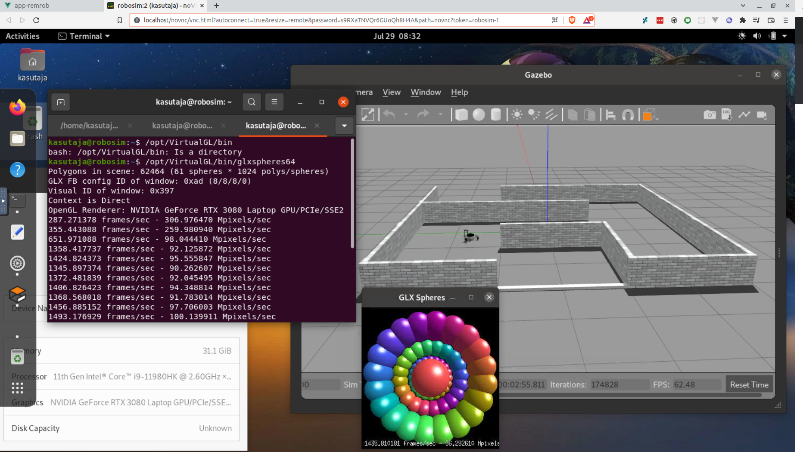

# A vnc-ros-gnome image with hardware acceleration support



## Main components

- GNOME Desktop
- TigerVNC server
- VirtualGL
- ROS

Inspired by:
- https://github.com/darkdragon-001/Dockerfile-Ubuntu-Gnome
- https://github.com/wwwshwww/novnc-ros-desktop
- https://github.com/willkessler/nvidia-docker-novnc
- https://github.com/Open-UAV/openuav-turbovnc

---
# Requirements
- Docker (>=27.5.0)
- Ubuntu (>=20.04) on host for Noetic images
- Ubuntu (=24.04) on host for Jazzy images

## Optional requirements
For running containers with hardware accelerated rendering of OpenGL apps like Gazebo:
- Nvidia GPU with a graphics driver compatible with CUDA >11.4 for Noetic, and [>12.6.3](https://docs.nvidia.com/cuda/cuda-toolkit-release-notes/index.html#id5) for Jazzy
- [nvidia-ctk](https://docs.nvidia.com/datacenter/cloud-native/container-toolkit/latest/install-guide.html)

# Setup

## Building the image

```bash
# two options available (noetic || jazzy)
bash ./build.sh --target jazzy

# or build version with cudagl support
bash ./build.sh --target jazzy --nvidia
```

# Running the container

For running images on Ubuntu 24.04 see steps [this section](#running-the-images-under-ubuntu-2404-jazzy-and-noetic) first.

## Base image:

### Noetic
```bash
docker run --rm \
	--tmpfs /run  --tmpfs /run/lock --tmpfs /tmp \
	--cap-add SYS_BOOT --cap-add SYS_ADMIN  \
	-v /sys/fs/cgroup:/sys/fs/cgroup \
	--name=robo-1 \
	-p 5902:5902 \
	-e PASSWORD=remrob \
	remrob:noetic-base

# or run with compose
docker compose -f noetic/docker-compose.yaml up
```

### Jazzy

```bash
docker run --rm \
	--tmpfs /run  --tmpfs /run/lock --tmpfs /tmp \
	--cap-add SYS_BOOT --cap-add SYS_ADMIN  \
	--security-opt apparmor=unconfined \
	-v /sys/fs/cgroup:/sys/fs/cgroup \
	--name=robo-1 \
	-p 5902:5902 \
	-e PASSWORD=remrob \
	remrob:jazzy-base

# or run with compose
docker compose -f jazzy/docker-compose.yaml up
```

The VNC server is running on port 5902, connect to it with any VNC client you have (default password: remrob).

## With nvidia-ctk:

### Noetic

```bash
docker run --rm \
	--tmpfs /run  --tmpfs /run/lock --tmpfs /tmp \
	--cap-add SYS_BOOT --cap-add SYS_ADMIN  \
	-v /sys/fs/cgroup:/sys/fs/cgroup \
	-v /tmp/.X11-unix/X1:/tmp/.X11-unix/X1 \
	--name=robo-1 \
	-p 5902:5902 \
	-e PASSWORD=remrob \
	-e VGL_DISPLAY=:1 \
	--runtime=nvidia \
	--gpus all \
	remrob:noetic-cudagl

# or the same with compose
docker compose -f noetic/docker-compose.cudagl.yaml up
```

### Jazzy
```bash
docker run --rm \
	--tmpfs /run  --tmpfs /run/lock --tmpfs /tmp \
	--cap-add SYS_BOOT --cap-add SYS_ADMIN  \
	--security-opt apparmor=unconfined \
	-v /sys/fs/cgroup:/sys/fs/cgroup \
	-v /tmp/.X11-unix/X0:/tmp/.X11-unix/X1 \
	--name=robo-1 \
	-p 5902:5902 \
	-e PASSWORD=remrob \
	-e VGL_DISPLAY=:1 \
	--runtime=nvidia \
	--gpus all \
	remrob:jazzy-cudagl

# or the same with compose
docker compose -f jazzy/docker-compose.cudagl.yaml up
```

The Nvidia GPU graphics are being tunneled through host's DISPLAY :0, but it can be switched to a different one (e.g. `-v /tmp/.X11-unix/X0:/tmp/.X11-unix/X1` --> `-v /tmp/.X11-unix/X1:/tmp/.X11-unix/X1`).

Until sysbox has released [GPU pass-through support](https://github.com/nestybox/sysbox/issues/50) the cgroup mounting solution remains.

## Customizing the gnome GUI

Replace the user binary file (e.g. `jazzy/config/user-base`) with your custom binary (found at `~/.config/dconf/user`) and rebuild.

**!NB!** For CudaGL images preserve or don't forget to add `vglrun /bin/bash` as the custom command in your profile, so the OpenGL apps like Gazebo are piped through VirtualGL.

## Running the images under Ubuntu 24.04 (Jazzy and Noetic)

**Base image:**
1) Must disable unified cgroup hierarchy in the Grub loader (systemd.unified_cgroup_hierarchy=0)

**CudaGL image additional steps:** 
1) Switch from default Wayland to Xorg display server
2) Enable host display access
```
xhost +local:docker
```

---

### Limitations:

- The containers are run with --cap-add=SYS_ADMIN in order to enable systemd, which is needed for Gnome (GDM).
- Does not work with Ubuntu 22.04 due systemd incompatibilites (see [this](https://github.com/geerlingguy/docker-ubuntu2004-ansible/issues/18))

&nbsp;&nbsp;

# Acknowledgments

Completed with the support by IT Academy Programme of Education and Youth Board of Estonia.

Valminud Haridus- ja Noorteameti IT Akadeemia programmi toel.
