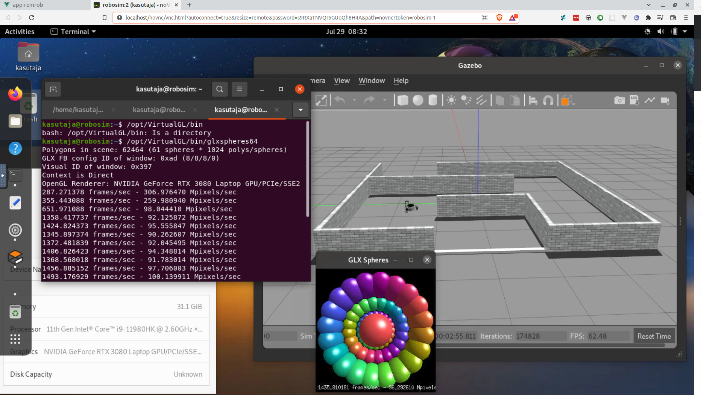

# A vnc-ros-gnome image with HA enabled

## Main components

- GNOME Desktop
- ROS Noetic
- TigerVNC server
- VirtualGL

Inspired by:
- https://github.com/darkdragon-001/Dockerfile-Ubuntu-Gnome
- https://github.com/wwwshwww/novnc-ros-desktop
- https://github.com/willkessler/nvidia-docker-novnc
- https://github.com/Open-UAV/openuav-turbovnc

---

Clone recursively, project uses [existing robotont software](https://github.com/robotont)

`git clone --recursive {REPO-URL}`

## Requirements

- Docker & docker-compose(1.28.0+)

For HA:
- Nvidia GPU with the appropriate drivers
- [nvidia-docker-runtime](https://docs.docker.com/config/containers/resource_constraints/#gpu) (comes with nvidia-docker2)

&nbsp;

# Setup

### Building the image

1. `docker build -t robotont:base .`

### Running the container

1. Change the `extra-hosts` directive in the docker-compose.yaml to your robot's hostname and IP address (e.g. "robotont-7:192.168.0.39")

2. `docker-compose up`

	Check VNC server status with:
	`docker exec robo-1 systemctl status tigervnc@:2`

	If it seems to be dead, start it up with:
	`docker exec robo-1 systemctl start tigervnc@:2`

3. The VNC server is running on port 5902, connect to it with any VNC client you have (pw: remrob). All the ports of the container are shared with the host in the "host" network mode. The Nvidia GPU graphics are being tunneled through host's DISPLAY :1.

## Customizing the gnome GUI

Replace the `user` binary file with your custom binary (found at `~/.config/dconf/user`) and rebuild

**!NB!** Preserve or don't forget to add `vglrun /bin/bash` as the custom command in your profile, so everything automatically pipes through VirtualGL

&nbsp;

&nbsp;&nbsp;

# Acknowledgments

Completed with the support by IT Academy Programme of Education and Youth Board of Estonia.

Valminud Haridus- ja Noorteameti IT Akadeemia programmi toel.
